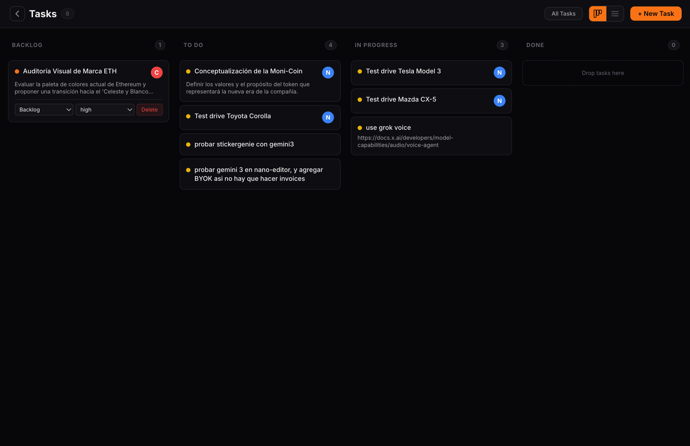
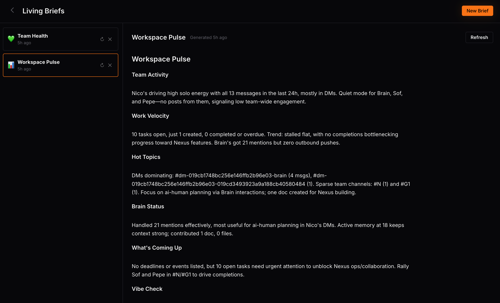
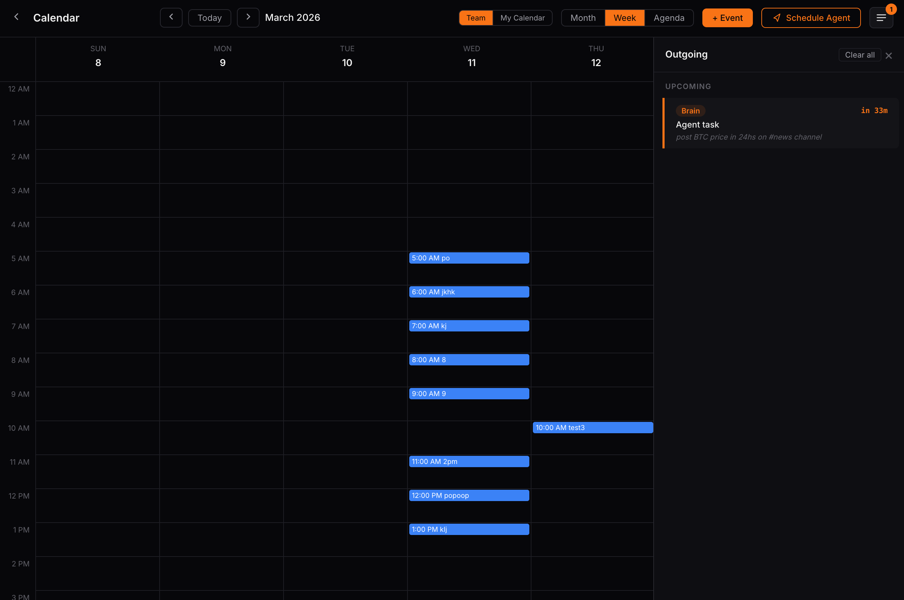
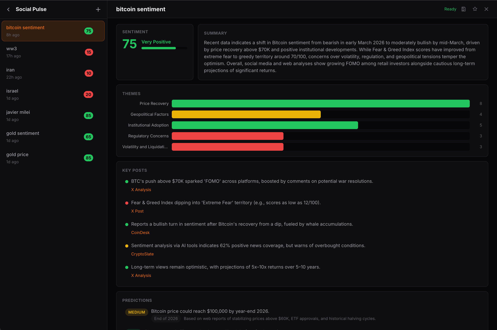
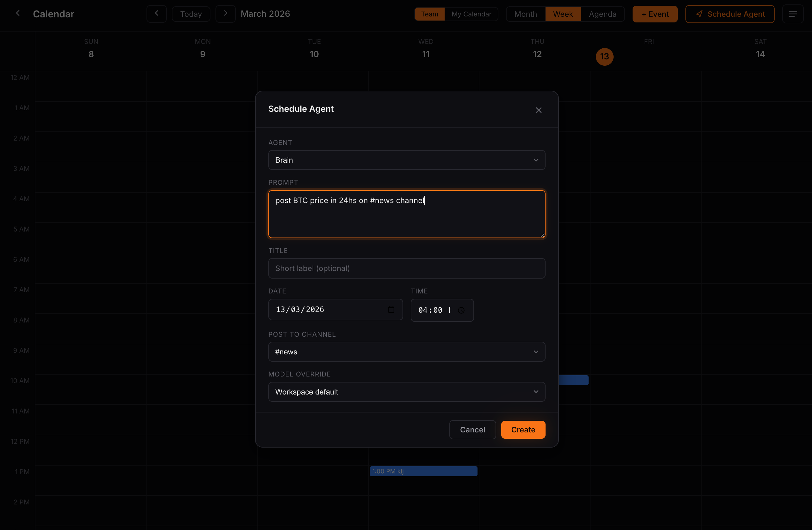

# Nexus

**A shared AI brain for your team — instant, private, self-hosted.**

Chat, tasks, docs, and an AI Brain that remembers everything — in a single binary you own completely.

[](https://github.com/vortex-303/nexus/releases)
[](LICENSE)
[](go.mod)
[](https://github.com/vortex-303/nexus/pkgs/container/nexus)



## Why Nexus

- **One binary, one file.** Go binary + SQLite, frontend embedded. Install on a $5 VPS or a spare machine; backup is `cp`. No Postgres, no Redis, no container fleet, no protocol to learn.
- **The AI comes included — and it remembers.** The Brain is a workspace member with persistent memory (pinned facts, per-person profiles, feedback it keeps), tools, and skills. Nothing to bring, run, or babysit.
- **Any model, including free.** OpenRouter, Google Gemini, Ollama, xAI, or any OpenAI-compatible endpoint. Free tiers and local models make $0 AI a real option. Every call's cost is tracked in a built-in dashboard.
- **Calm by default.** All autonomous behaviors ship **off**. The Brain acts when you @mention it; every automation you enable sits behind a single kill switch. Zero telemetry, zero tracking.

## Features

- **Real-time chat** — Channels, DMs, markdown, file sharing, @mentions
- **AI Brain** — Persistent memory, tool calling, knowledge base, heartbeat scheduler
- **Custom agents** — 9 templates or define your own in markdown. Each gets tools, skills, and a role
- **Tasks** — Create from conversations, assign, track. Brain follows up on deadlines
- **Documents** — Rich editor with code blocks, checklists, and auto-save
- **MCP tools** — Extend with web search, databases, APIs — any MCP server
- **Roles & permissions** — 9 roles, 31 permissions, org chart with hierarchy
- **Integrations** — Webhooks, inbound email (SMTP), Telegram bot
- **English + Español** — first-class in the product and docs

| | |
|---|---|
|  |  |
|  |  |

## Quick Start

### Cloud

Visit [nexusteams.dev](https://nexusteams.dev) — name your workspace and start.

### Self-Host

```bash
# Install (Linux; on macOS use Docker or build from source)
curl -fsSL https://raw.githubusercontent.com/vortex-303/nexus/main/install.sh | sh

# Run
nexus serve
# Nexus running at http://localhost:8080
```

### Docker

```bash
docker run -p 8080:8080 -v nexus_data:/data ghcr.io/vortex-303/nexus
```

### Build from Source

```bash
git clone https://github.com/vortex-303/nexus.git
cd nexus
make dev    # Builds web + Go, runs on http://localhost:8080
```

**Requirements:** Go 1.25+, Node.js 22+, gcc (for SQLite CGO)

## Configuration

Nexus loads config from three layers (each overrides the previous):

1. `~/.nexus/nexus.toml` or `./nexus.toml`
2. CLI flags: `--listen`, `--data-dir`, `--domain`, `--dev`
3. Environment variables: `LISTEN`, `DATA_DIR`, `DOMAIN`, `SMTP_LISTEN`

```toml
# ~/.nexus/nexus.toml
listen = ":8080"
data_dir = "~/.nexus"
domain = "nexus.mycompany.com"   # Enables auto-TLS via Let's Encrypt
```

### Auto-TLS

Set a `--domain` and Nexus will automatically provision Let's Encrypt certificates:

```bash
nexus serve --domain nexus.mycompany.com
```

## Data

All data lives in `~/.nexus/` (or `DATA_DIR`):

```
~/.nexus/
  nexus.db                    # Global database (accounts, workspaces)
  workspaces/
    <slug>/
      workspace.db            # Per-workspace database
      brain/memory/           # Brain's persistent file memory
      brain/skills/           # Brain skill files
      blobs/                  # Uploaded files (content-addressed)
```

Back up with `cp -r ~/.nexus/ ~/nexus-backup/`.

## Brain Setup

1. Open your workspace → Brain tab → Settings
2. Add your [OpenRouter API key](https://openrouter.ai/keys) (or Gemini, Ollama, xAI, any OpenAI-compatible endpoint)
3. @Brain in any channel to start

The Brain answers with context from workspace history and its persistent memory. Autonomous features (scheduled briefs, background memory extraction, heartbeat) are **off by default** — enable them in Brain Settings → Automations when you want them.

## License

[AGPL-3.0](LICENSE)
